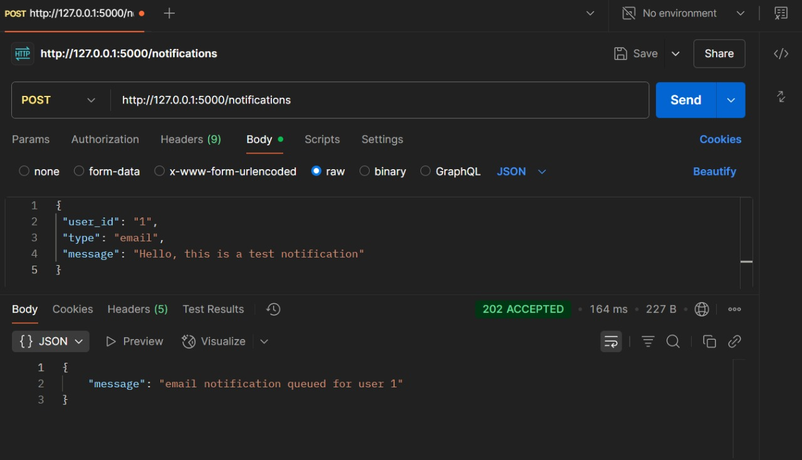
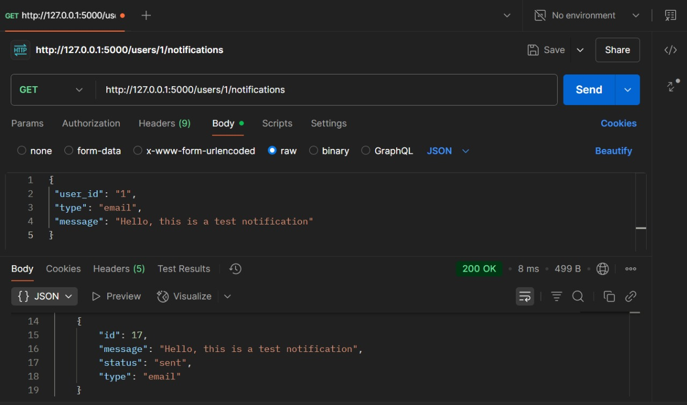

<p align="center">
  
  
  
</p>


# Flask Notification Service with RabbitMQ

A simple Flask-based notification service that supports sending notifications via Email, SMS, and In-App messages. Notifications are queued using RabbitMQ and processed asynchronously by a worker (consumer.py).


## Features

- REST API to create and retrieve notifications
- Supports three notification types: `email`, `sms`, and `inapp`
- Uses RabbitMQ as a message broker for asynchronous processing
- Worker process listens to RabbitMQ queue and updates notification status
- Retry mechanism on notification delivery failure
- Uses SQLite database with SQLAlchemy ORM for persistence

## Project Structure

```
flask_assignment/
├── app.py                # Flask app initialization and routes registration
├── models.py             # SQLAlchemy models (Notification)
├── requirements.txt      # Python dependencies
├── routes/
│   └── notifications.py  # Notification API endpoints (Blueprint)
├── worker/
│   └── consumer.py       # RabbitMQ worker that processes notifications
├── instance/
│   └── notifications.db  # SQLite database (auto-created)
└── templates/
    └── index.html        # Home page template
```

## Getting Started

### Prerequisites

- Python 3.8+
- RabbitMQ Server ([Installation Guide](https://www.rabbitmq.com/download.html))(Optional)
- Docker Desktop (Recommended)
- `pip` for installing Python packages

### Installation

1. Clone the repo:
   ```bash
   git clone <https://github.com/saksham-0425/Notification_service>

2. Install dependencies:
   ```bash
   pip install -r requirements.txt

3. If you don’t have RabbitMQ installed locally, you can run it easily with Docker:
   ```bash
   docker run -d --hostname rabbit --name rabbitmq \
   -p 5672:5672 -p 15672:15672 \
   rabbitmq:3-management

4. Access RabbitMQ UI:
   Open: http://localhost:15672
   Login:
   Username: guest
   Password: guest

6. Initialize the database (auto happens on first run, or explicitly run):
   ``` bash
   python app.py

### Running the app and worker

1. Start the Flask app:
   ```bash
   python app.py

2. Start the RabbitMQ worker in another terminal:
   ```bash
   python -m worker.consumer

## API Endpoints (Testing with 'Postman')

### SEND Notification

-  URL: /notifications
-  Method: POST
-  Body (JSON):
   ```json
   {
    "user_id": "1",
    "type": "email",
    "message": "Hello, this is a test notification"
   }
-  Response: 202 Accepted when notification is queued
  
### GET Notification

-  URL: /users/<user_id>/notifications
-  Method: GET
-  Response :
   ```json
   [
   {
    "id": 1,
    "type": "email",
    "message": "Hello, this is a test notification",
    "status": "sent"
   },
   ...
   ]

## Testing Retry Logic

The worker includes a retry mechanism that attempts to resend notifications up to 3 times if processing fails. To test this, you can simulate failure in the worker code by temporarily forcing an exception.

## Dependencies

- Flask
- Flask-SQLAlchemy
- pika (RabbitMQ client)
- SQLite3 (builtin with Python)

## Notes

- RabbitMQ Management UI is available at http://localhost:15672 (default user/pass: guest/guest).
  <p align='center'></p>
- Notifications are persisted in notifications.db SQLite file.
- Ensure worker/consumer.py and Flask app share the same model and DB config for consistency.

# Licence
MIT


